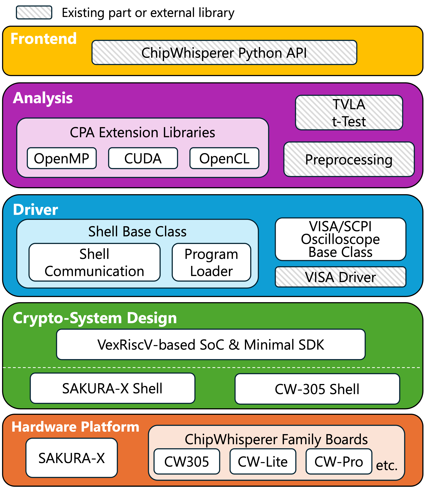

# Chipwhisperer-Enhanced-Plugins
[](https://github.com/hal-lab-u-tokyo/chipwhisperer-enhanced-plugins/actions/workflows/build.yml)
[](https://opensource.org/licenses/MIT)


This repository provides enhanced plugins for the [Chipwhisperer](https://github.com/newaetech/chipwhisperer) framework, which is a popular platform for hardware security research. The plugins extend the capabilities of Chipwhisperer by providing support for various hardware platforms, capture devices, and analysis algorithms, as shown in the figure below.



[Detailed documentation](./docs/README.md) is available in the `docs` directory.

Technical details of the plugins are also described in the following paper:

Takuya Kojima, Masaki Morita, Hideki Takase, and Hiroshi Nakamura, "An Open-Source Framework for Efficient Side-Channel Analysis on Cryptographic Implementations", Cryptology ePrint Archive, Report 2025/1130 (a preprint version of the paper, https://eprint.iacr.org/2025/1130)

## Extended features
### Supported hardware platforms
* SAKURA-X board configured with SASEBO-GIII sample design
* ESP32
* [SAKURA-X shell](https://github.com/hal-lab-u-tokyo/sakura-x-shell)
* [CW305-shell](https://github.com/hal-lab-u-tokyo/cw305-shell)
* [VexRiscv_SCA](https://github.com/hal-lab-u-tokyo/VexRiscv_SCA)
* AES Examples in [sca_design_repo](https://github.com/hal-lab-u-tokyo/sca_design_repo) based on the both shells
  * RTL implementations and HLS implementations


### Capture devices
* VISA compatible oscilloscopes
  * Keysight Infiniviion 40000 (MSO-X 4101A tested)
  * Rigol MSO8000 (MSO8104 tested)
You can integrate your own VISA-compatible oscilloscopes by creating a custom class that inherits from the provided base class.

### Analysis algorithms
* Many-core/GPU-accelerated Correlation Power Analysis
  * OpenMP parallelization for multi-core CPUs
  * CUDA for NVIDIA GPUs
  * OpenCL for NVIDIA, AMD, Intel and Apple GPUs
  * Quad-precision floating-point emulation for double-precision-only CPU (e.g, Apple Silicon CPUs)
  * Double-precision floating-point emulation in OpenCL for single-precision-only GPUs (e.g., Apple Silicon GPUs, Intel Arc GPUs)


## Note for Cloning

This repository uses submodules to manage dependencies and related projects. To ensure all submodules are properly initialized and updated, use the following command when cloning:

```
git clone --recursive https://github.com/hal-lab-u-tokyo/chipwhisperer-enhanced-plugins
```

If you have already cloned the repository without the `--recursive` flag, you can initialize and update the submodules manually by running:

```bash
git submodule update --init --recursive
```

## Directory structure
* lib: python library source
* hardware: target hardware related files and submodules
* notebooks: Sample Jupyter Notebooks
* udev-rules: udev rule file for devices related to side-channel attack evaluation
* docs: documentation files
* cpp_libs: C++ library source
* docker: Dockerfile for building docker images and docker-compose files for running the analysis environment

## Getting Started
See the Setup Guide of [documentation](./docs/README.md) for instructions on how to set up the environment and run the analysis.

## Tutorials
* [Tutorial 1: 1st-order CPA on DPA Contest V2 dataset](./notebooks/tutorial_cpa.ipynb)
* [Tutorial 2: 2nd-order CPA on ASCAD dataset](./notebooks/tutorial_socpa.ipynb)

## Open Datasets
We plan to release datasets generated using this framework, as described in the aforementioned paper, in the near future.

## Our Related Projects
* [cw_ml_plugins](https://github.com/hal-lab-u-tokyo/cw_ml_plugin): A collection of machine learning based attack plugins for ChipWhisperer.


## Special Thanks to Those Who Assisted in this development
* Masaki Morita
* Youhyun Kim
